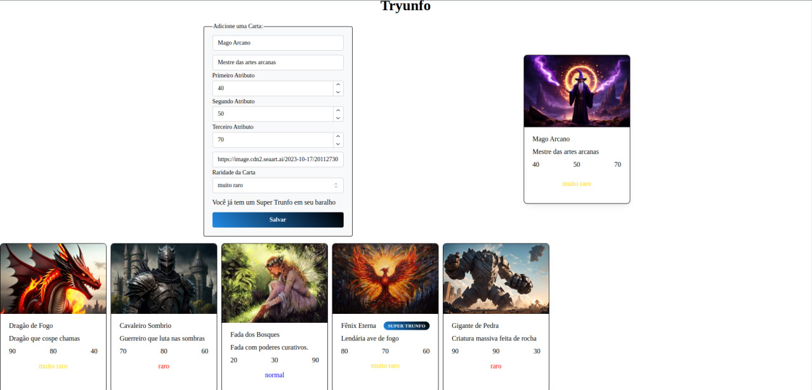

# Projeto de Gerador de Cartas com React

## Resumo do Projeto
Este projeto foi desenvolvido para criar cartas personalizadas através de um formulário dinâmico, que atualiza a visualização da carta em tempo real conforme os dados são inseridos. A aplicação foi construída usando React, demonstrando o domínio sobre PropTypes e várias funcionalidades interativas. A aplicação permite a criação de cartas, que são exibidas abaixo do formulário, respeitando a regra de que apenas uma carta pode ser marcada como super trunfo. Fui responsável por desenvolver os arquivos principais e componentes da aplicação. O projeto foi realizado em colaboração com outro desenvolvedor.

## Descrição do Projeto
O projeto de gerador de cartas é uma aplicação web que permite aos usuários criar cartas personalizadas. A interface inclui campos de entrada para nome, descrição, atributos da carta, URL da imagem, raridade e um checkbox para marcar a carta como super trunfo. A visualização da carta é atualizada em tempo real conforme os dados são preenchidos. O botão de criação de carta fica disponível apenas após todos os campos serem preenchidos. As cartas criadas são exibidas em uma seção separada abaixo do formulário, e a funcionalidade de super trunfo impede que mais de uma carta tenha essa característica.

## Funcionalidades Implementadas
- Campos de entrada para nome, descrição, atributos, URL da imagem, raridade e super trunfo
- Visualização em tempo real da carta conforme os dados são inseridos
- Botão de criação de carta habilitado somente após preenchimento de todos os campos
- Exibição de cartas criadas em uma seção separada
- Restrição de apenas uma carta com a característica de super trunfo

## Arquivos Criados e Modificados por Mim
- `App.js`
- `index.js`
- Componentes:
  - `Card.js`
  - `Form.js`
  - `ListCard.js`

## Tecnologias Utilizadas
- React
- PropTypes
- JavaScript (ES6+)

## Link do Deploy
O projeto está disponível online e pode ser acessado através do seguinte link:
[Link do Deploy da Aplicação](#)

## Imagens do Projeto
Abaixo estão algumas imagens que demonstram como é a aplicação:

